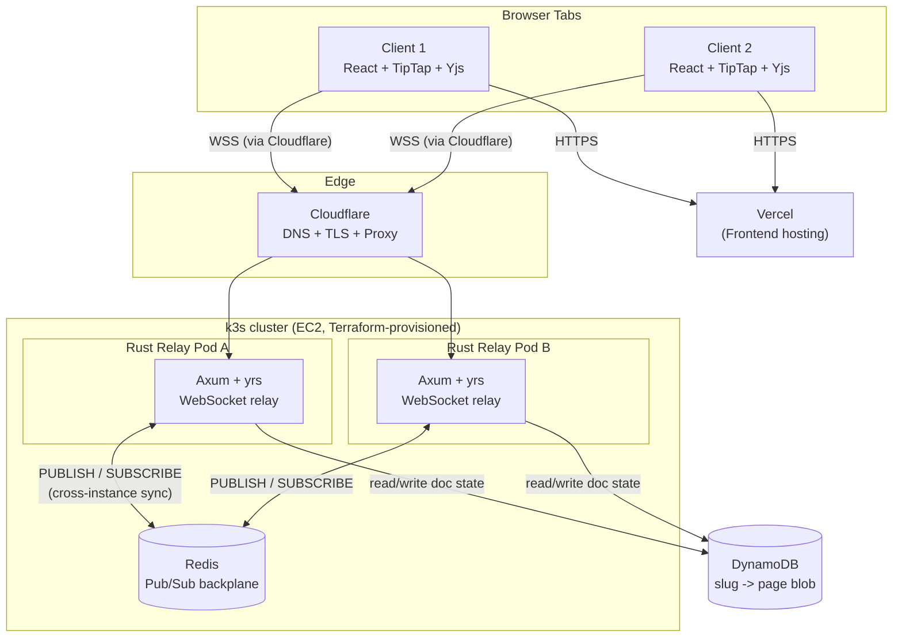
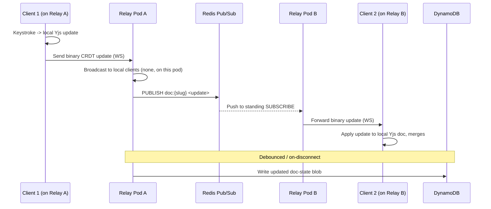

---
created:
  - " 08-12-2026 21:54"
tags:
  - ProjectSpec
  - Project/Organizer
---

# OpenPage — Project Reference Doc

## Blurt

A multi-part system design project to build a Notion/Google-Docs-style collaborative
block editor. The functional core is small — persistent pages, websockets, conflict
resolution — but the actual goal is to emulate a professional deployment: multiple
server instances, concurrent users, real conflict handling, and full network/infra
lifecycle (provisioning, CI/CD, orchestration).

No auth. The URL/slug *is* the access model (Etherpad/HackMD-style). No image
uploads (cost control).

---

## 1. Main Server — Rust

- **Web framework: Axum** (built on the Tokio/Tower/Hyper stack), using
  `axum::extract::ws` for the WebSocket upgrade + message loop.
  - Chosen over raw `tokio-tungstenite` (axum uses tungstenite internally anyway —
    it's not a competing library, it wraps it) because axum's router gives us
    `/ws/:slug` + a plain `/healthz` route (needed for k8s readiness probes) for
    free, without hand-rolling HTTP upgrade handling.
  - Chosen over Actix-web despite Actix's actor model being arguably a *more*
    interesting concurrency pattern to learn, and despite Actix's stronger raw
    throughput — axum's tighter fit with the rest of the Tokio ecosystem
    (tower middleware, hyper) won out, and raw throughput is a non-factor for
    an MVP relay.
- **CRDT logic:** [`yrs`](https://github.com/y-crdt/y-crdt/tree/main/yrs) — the
  canonical Rust implementation of Yjs's CRDT, other language bindings wrap
  *this*, not the other way around.
- **Design:** relay-style server. Broadcasts opaque Yjs binary update messages
  between clients in a "room" (keyed by slug). Does **not** parse CRDT semantics
  server-side — that happens client-side in Yjs. Server is a dumb pipe by design.

### Working method (binding — see CLAUDE.md)
Core relay/CRDT logic is hand-written, not Claude-Code-generated — the point of
using Rust here is to build real ownership/borrow-checker fluency. Claude Code
is only used at full speed for the infra/deploy layer (Terraform, k3s manifests,
CI YAML), where speed is the actual goal.

---

## 2. Persistence — DynamoDB

- **Shape:** `slug (PK) → { title, theme, blocks: [ {blockId, blockType, text,
  formatting}, ... ], updatedAt }` — single item per page, written/read atomically.
- Chosen over self-hosted Postgres for this project specifically:
  - Novelty/personal interest in the NoSQL access pattern
  - Managed backups, materially lower data-loss risk than self-managed Postgres
    on a single EC2 instance
  - Stronger AWS-ecosystem signal — this project's job is cloud-engineer/DevOps
    signal, not database-design signal (that's reserved for a future project)
  - Free tier headroom is real: DynamoDB frees up the ~150-300MB Postgres would
    have needed out of the t3.small's ~2GB, in an already-tight k3s +
    Redis + Rust budget
- **Caveat carried forward:** because persistence is CRDT-backed (Yjs), the
  *real* source of truth for a document is technically an opaque binary doc-state
  blob, not structured block records. The structured shape above is the
  interview-flex / queryable version of this project, chosen deliberately over
  the "purist" blob-only version for portfolio/learning value.
- Hetzner-portability was considered as a factor early on and explicitly
  **dropped** — this project is not expected to outlive AWS credits; assume the
  project is retired (or dormant) once a job is secured, revisited only when
  job-searching again.

---

## 3. Redis — Cross-Instance Pub/Sub

- **Purpose:** solves the multi-replica broadcast problem — Client 1 on relay
  instance A and Client 2 on instance B, both editing the same doc, need to see
  each other's edits even though neither instance has a direct connection to the
  other's clients.
- **Mechanism:** each instance holds a standing `SUBSCRIBE` connection to Redis
  per active room. On a local edit, the receiving instance `PUBLISH`es the CRDT
  update to that room's channel; Redis pushes it instantly to every other
  subscribed instance, which then forwards to its own connected WebSocket
  clients. This is **push-based**, not polling — the standing subscribe
  connection costs nothing idle and receives with no round-trip delay.
- **Why Redis over the alternatives:**
  - *Sticky sessions* (route all clients on a slug to the same instance) were
    the first instinct, but this breaks under a "hot page" — one popular doc
    still pins all its traffic to a single instance regardless of that
    instance's load (same failure mode as a bad Kafka partition key).
  - *Direct instance-to-instance gossip* was discounted mainly on a membership-
    tracking problem, not just raw connection count: every instance would need
    to discover and track the current live set of peers as pods restart/scale
    under k3s rolling updates. Redis sidesteps this — new instances just
    subscribe, no peer-discovery/coordination needed at all.
- **Self-hosted in k3s** (not ElastiCache): keeps cost on the already-paid-for
  EC2 compute instead of a separate billed service, and — now that Hetzner
  portability is off the table — the deciding factor is that self-hosting gives
  k3s an actual second real workload to orchestrate (StatefulSet + PV +
  Service), which is a stronger K8s demo than a single-pod cluster.

---

## 4. Front End

- **React + TipTap** (ProseMirror wrapper), bound to **Yjs** via `y-prosemirror`.
- Block model = a tree of nodes (paragraph/heading/bullet/todo/anchor); the text
  *within* each block is its own CRDT text type. This split — block structure as
  one CRDT type, text-within-block as another — is why concurrent edits to
  different (or the same) block merge cleanly instead of clobbering each other.
- **Hosted on Vercel** (free tier) — frontend only. The WS relay is not hosted
  here; Vercel's native WS support is Node-only/beta/single-instance-pinned, and
  the backend is Rust regardless.
- No image uploads. URL-sharing for links is a possible later addition.

---

## 5. CI/CD

- **GitHub Actions** builds the Docker image → pushes to **GHCR** (free for
  public repos) → `kubectl apply` triggers a pod-level rolling update
  (k8s-native, zero extra cost, zero downtime). This is the primary,
  continuously-used deploy path.
- Pipeline **gates on an actual test suite** (CRDT merge correctness, room
  broadcast behavior) — not just a successful build.
- Instance-level blue-green (parallel EC2, cut over via Cloudflare DNS) is kept
  only as a **one-time documented stretch exercise**, not a continuous practice
  — it doubles compute cost on every rollout.

---

## 6. Deployment

- **k3s** — full Kubernetes API, single lightweight binary. Chosen over vanilla
  k8s because it's a lighter single-binary implementation of the *same* API
  (not a "single-node-only, lesser" tool — it scales to multi-node exactly like
  standard k8s when needed). Honest framing: for a single-relay MVP, k3s is
  mostly resume/practice value; its real technical payoff (self-healing,
  scheduling, rolling updates) only kicks in once Phase 5 (multi-replica) is
  live.
- **Terraform** provisions EC2, security group, Elastic IP, DNS record.
  Declarative + versioned; `apply`/`destroy` used deliberately to control cost
  (spin up only when actively working/demoing).
  - Chosen over CloudFormation/CDK despite those being AWS-native/free, mainly
    for ecosystem/job-listing dominance and closer fit to the rest of the
    non-AWS-specific stack (k3s manifests, Docker) — the original
    Hetzner-portability argument for this choice no longer applies (see above)
    but the pick still holds on its own merits.
  - **SSH access:** key pair generated locally (`ssh-keygen`), public half
    referenced in Terraform via `aws_key_pair`, private half never touches
    Terraform state. (Deliberately not using Terraform's `tls_private_key`
    resource, which would put the private key in plaintext state.)
- **Cloudflare** — DNS + free TLS + DDoS protection via proxy. Confirmed
  WebSocket support on the free plan. Heartbeat pings required from the relay
  server due to Cloudflare's 100-second idle WebSocket timeout on free/Pro plans.

---

## System Diagram

---

## Sequence Diagram — Single Edit, Cross-Instance

---

## Phased Roadmap (see full write-up for time estimates)

0. Rust/CRDT fundamentals, local only, no networking
1. Local relay + two-tab live sync — no persistence yet **(earliest real demo)**
2. Persistence — wire in DynamoDB
3. Containerize + single-instance deploy (Terraform + k3s, single pod)
4. CI/CD — GitHub Actions → GHCR → rolling update **(MVP line)**
5. Multi-replica scaling — Redis pub/sub, 2+ relay pods, readiness probes,
   graceful shutdown
6. Stretch/polish — blue-green exercise, presence/cursor UI, link-sharing

MVP = Phases 0–4. Full project = Phases 0–5. Phase 6 is optional, time-permitting.