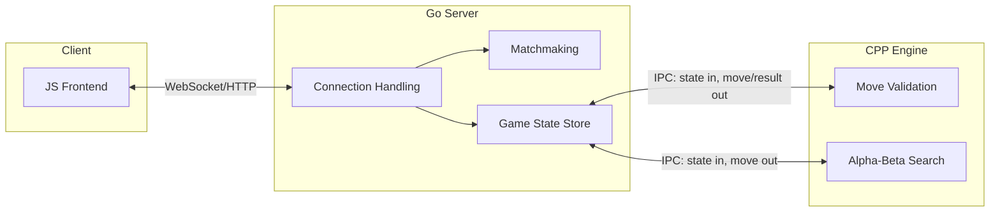

---
created:
  - " 07-30-2026 16:12"
tags:
  - ProjectSpec
  - Project/Organizer
---

# Score4 — Project Overview

## Goal

Coordinate the communication between a C++ engine and game state manager, and a Go Server handling connections and concurrency

## Architecture Summary

**Separation of concerns:**
- **C++**: game *rules* + game *intelligence*. Pure, stateless functions over a given bitboard state. No persistence, no networking, no concept of "players" or "sessions."
- **Go**: game *state* (source of truth for every active game), *connections* (matchmaking, reconnects), *orchestration* (calls out to C++ for validation/AI moves).

> [!note] Why C++ is stateless
> Keeping C++ as `state in → move/result out` makes it trivially testable, easy to reason about, and safe to call concurrently (no shared mutable state inside the engine). Go is the only thing that persists anything.

## Components

| Part           | Owner   | Responsibility                                                  |
| -------------- | ------- | --------------------------------------------------------------- |
| 1. Engine core | C++     | Compact game state repr, bitmask win detection, move generation |
| 2. AI engine   | C++     | Alpha-beta pruning, move ordering, eval function                |
| 3. Server      | Go      | Connection handling, matchmaking, game state, calls to C++      |
| 4. Deployment  | AWS EC2 | Hosting, live demo                                              |

See individual specs: [[Score4-Engine]], [[Score4-AI]], [[Score4-Server]]
IPC Specs: [[Score4-IPC]]

## Open Question: Move Validation Frequency
Does Go duplicate simple win/valid-move checks itself, or does *every* move round-trip through C++ (even non-AI moves)?

- **Round-trip everything** → C++ is the single source of truth for rules, no logic duplication/drift risk. But higher call volume — matters more once transport is subprocess (process spawn cost) vs gRPC (cheap, persistent connection).
- **Go duplicates simple checks** → fewer round-trips, but now rules logic exists in two languages and could drift.

Leaning toward **round-trip everything through C++** — keeps rules logic in exactly one place, and it's a more interesting scaling problem for part 3 (frequent small IPC calls). Revisit once [[Score4-Server]] concurrency model is drafted.

## IPC Strategy: Subprocess → gRPC Migration

**Plan:** build v1 with subprocess spawning (fast to ship, simple to debug), then refactor to gRPC once the core system works end-to-end. The data *contract* (what a "state" and a "move" look like) is designed once, up front, so the transport swap doesn't touch game logic — only the Go-side call site and a new C++ entrypoint (server loop instead of `main()` reading stdin).

## Done Criteria (project-level)
- [ ] Two players can connect via frontend and play a full game against each other
- [ ] A player can play against the AI engine
- [ ] Server correctly handles disconnects/reconnects without corrupting game state
- [ ] Deployed and playable live on EC2
- [ ] (Stretch) IPC layer refactored from subprocess to gRPC