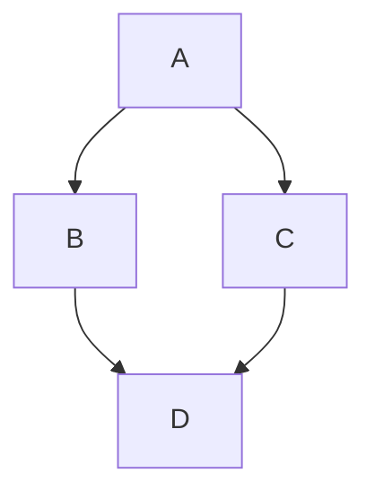

---
created:
  - " 07-30-2026 15:20"
tags:
  - Project
aliases:
  - 3D Connect4
---

---
## Dataview:
```dataview
list from [[]] and !outgoing([[]])
```
---


## 🧲 Published
### Deployment:
- 
### GitHub:
- 

## 🎟 Features
### Existing

### Todo



## 🧾 Project Description

### Blurt

A 4 part project: a score4 engine and concurrent server
1) Writing score4 with fast game state checking and things like that (compacted game state, bitmask for wins, things like that)
2) A engine with alpha beta pruning and things like that as a fun opponent
3) A concurrent server letting people play each other, learning about the issues with scaling first hand
4) Deploying it to AWS on an EC2 for a live demo (playing opponents or the engine)

### Official
[[Score4-Overview]]


## 📂 Project Logs 


## 🔗 -> Links
### Resources
- Put useful links here

### Connections
- Link all related words

